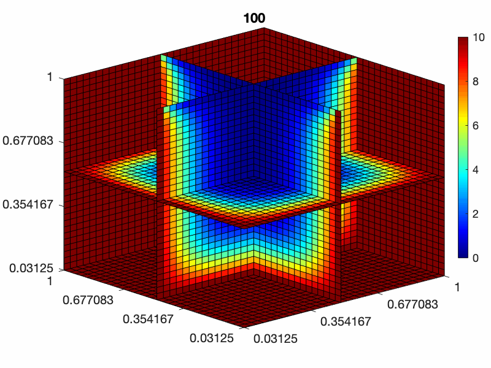
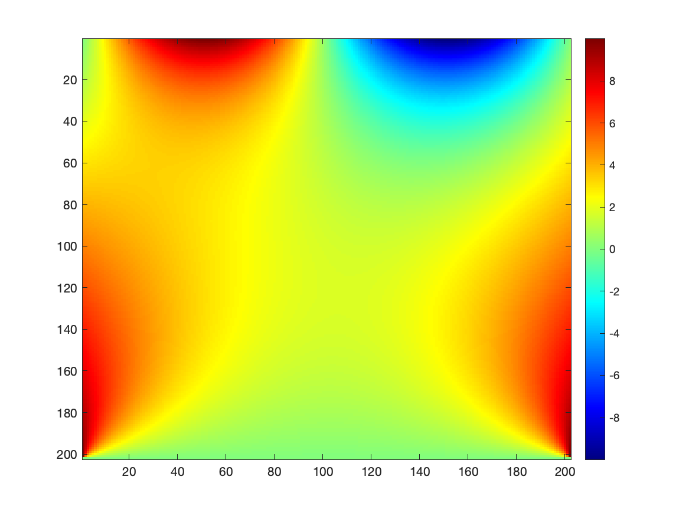
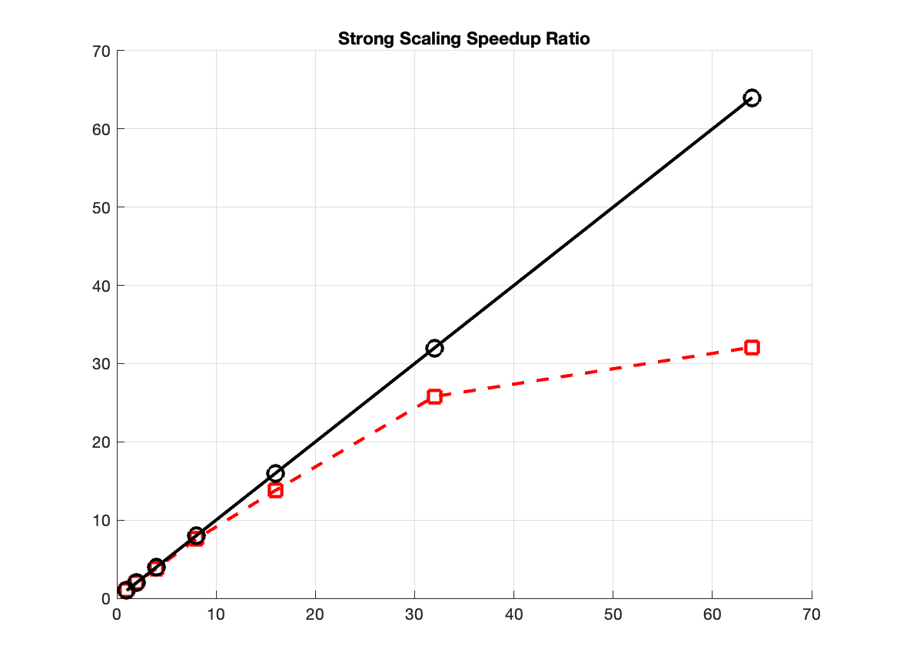
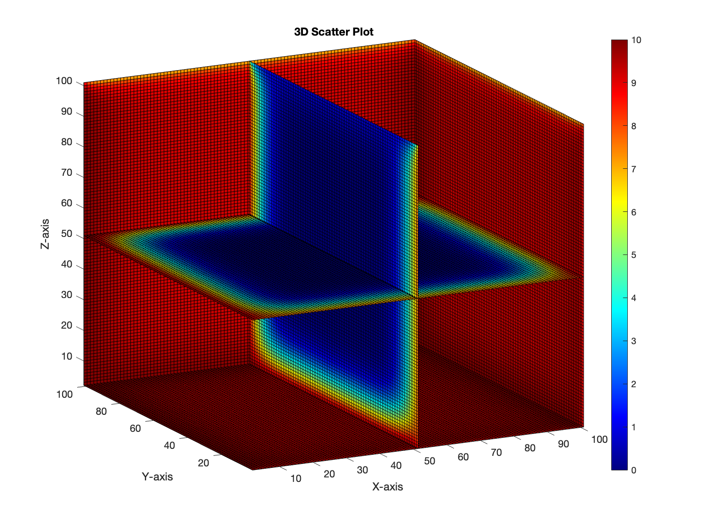
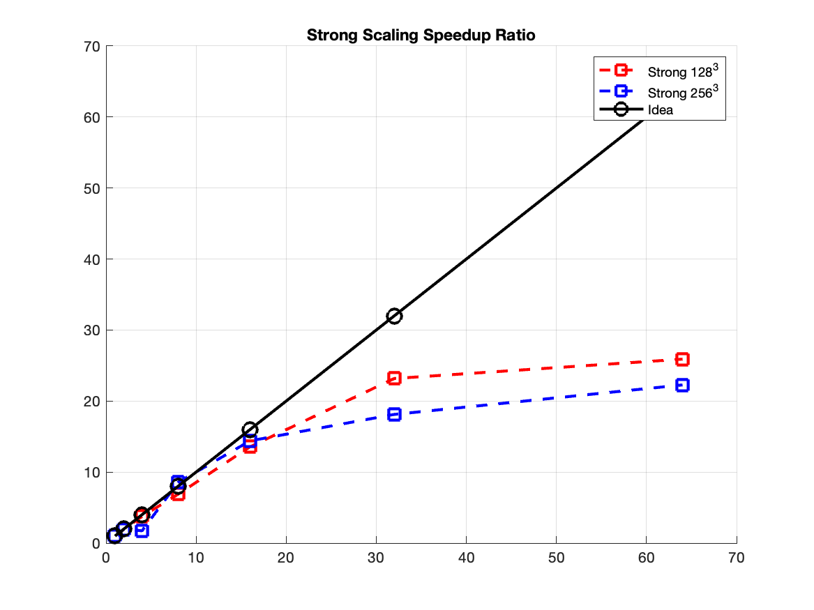
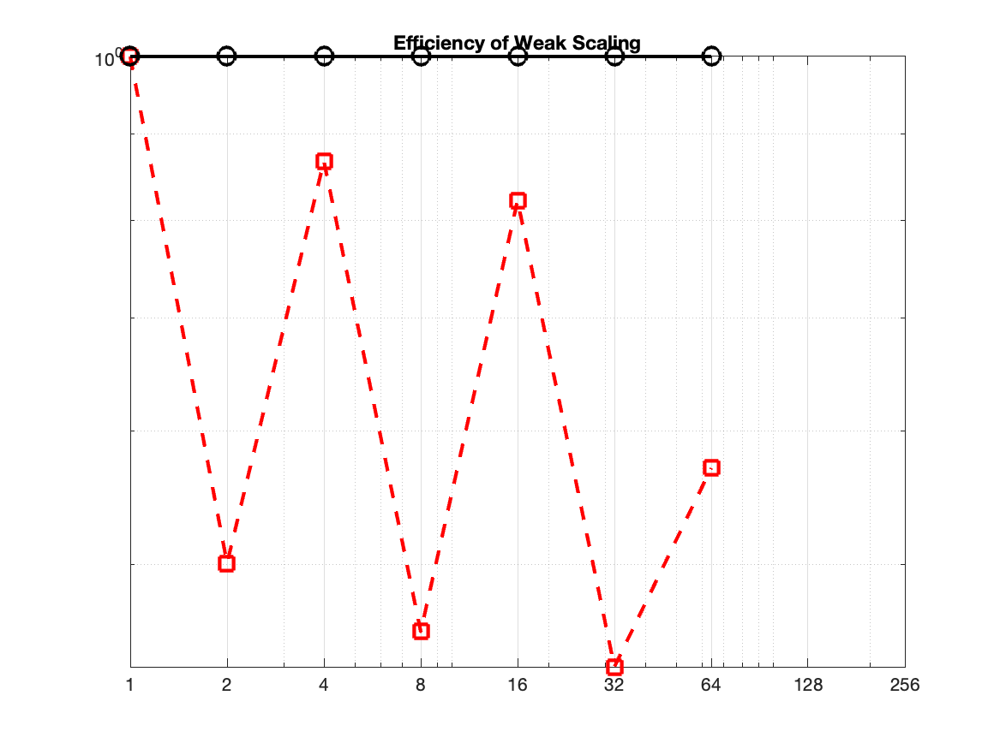
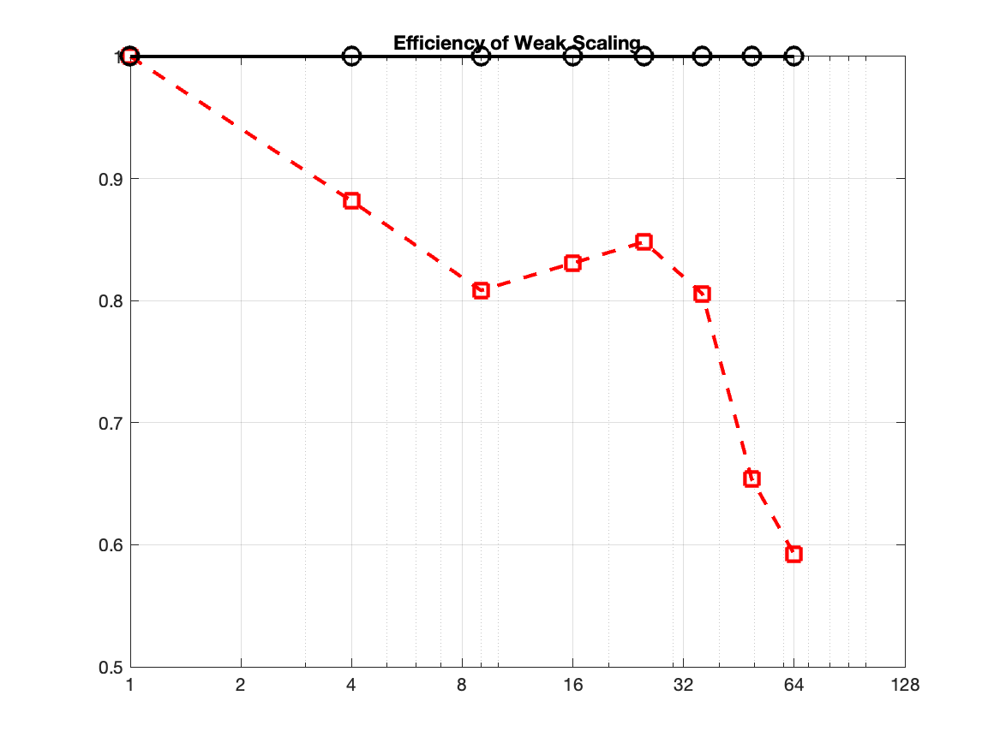
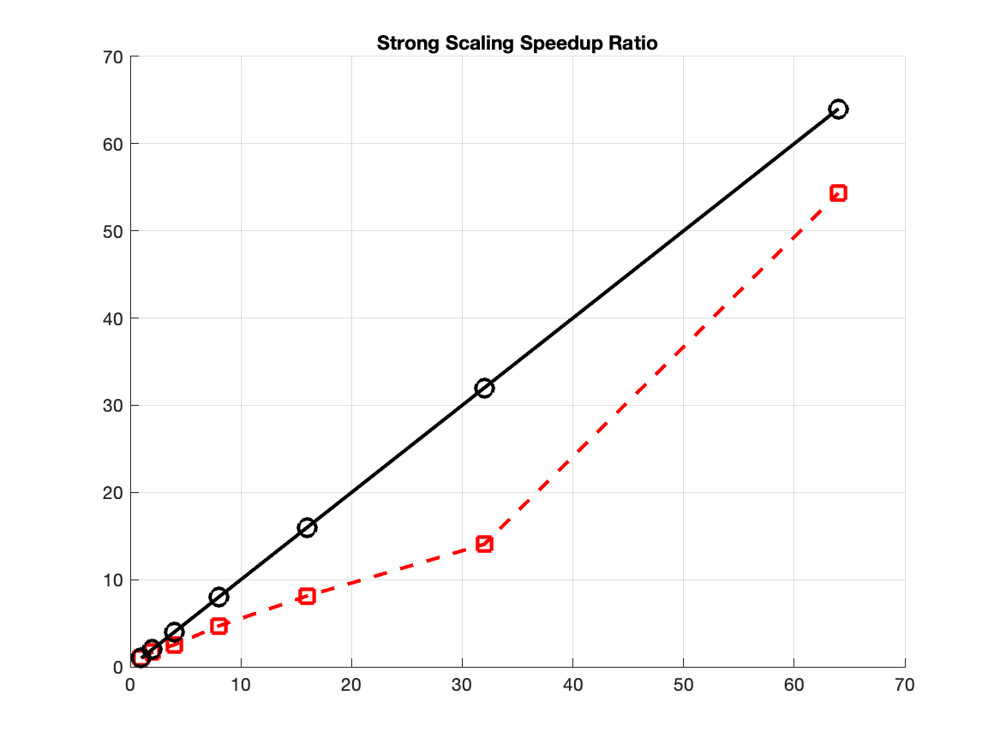
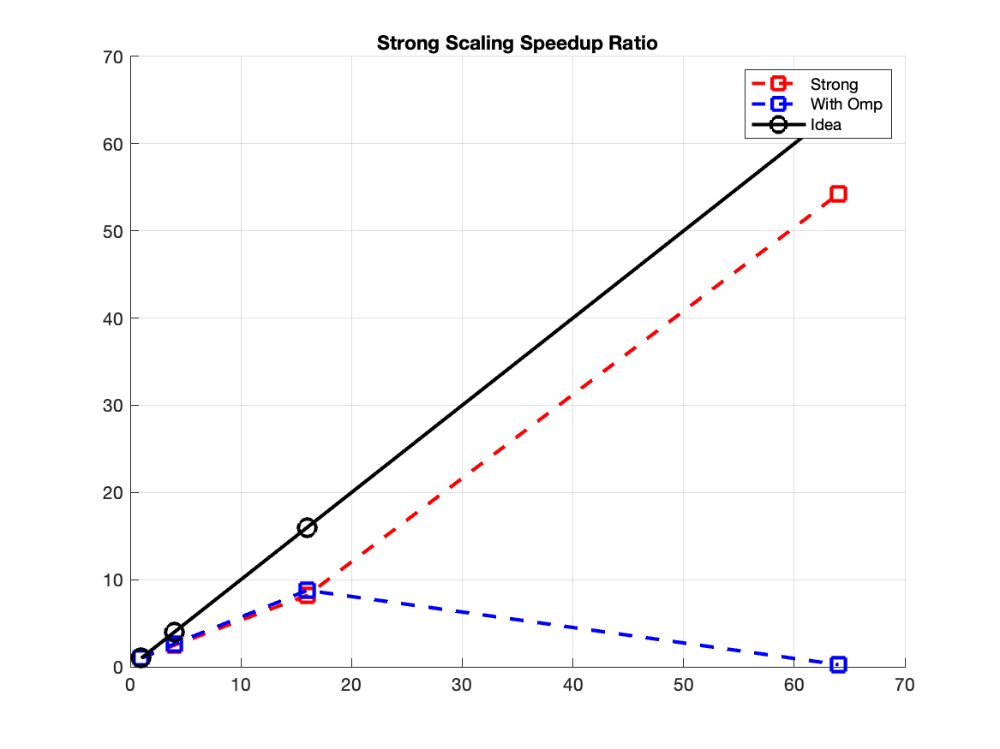
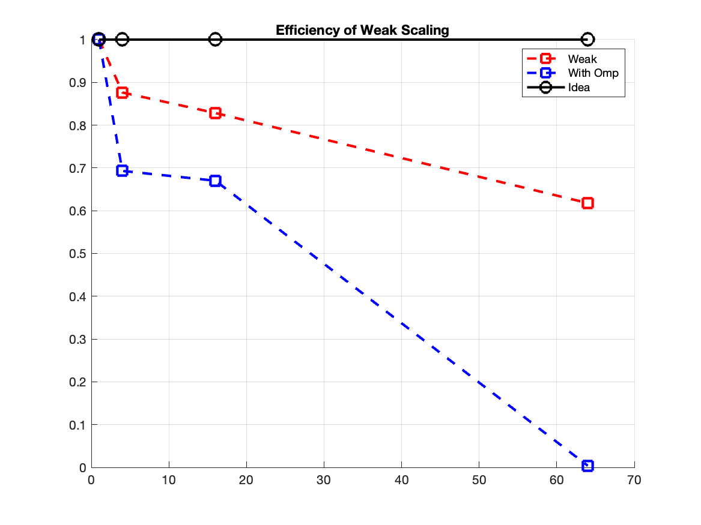

# Final-Project

<!--  -->
This is the final project of M.Sc in High Performance Computing program.
Currently, research is focusing on finding numerical solutions of Partial
Differential Equations (PDEs), including heat equations.

### Report Note

- Two main reasons for using meta-programming techniques:
    - Improved type safety
    - Improved run-time performance
<!-- $$
\frac{\partial u}{\partial t} 
(t,\textbf{x})
= 
\kappa\nabla^2_{\textbf{x}}
u(\textbf{x}, t)
, \:\:\:\: \textbf{x} \in \Omega \sub \mathbb{R}^d, d\in \{1, 2, 3\}.
$$

Dirchlet Boundary Condition
$$
u(t,\textbf{x}) = f(\textbf{x}), , \:\:\:\: \textbf{x} \in \bar{\Omega}
$$

Neumann Boundary Condition
$$
\frac{\partial u}{\partial \vec{n}} 
(t,\textbf{x})
= g(\textbf{x}), \:\:\:\: \textbf{x} \in \bar{\Omega}
$$ -->


<!--  -->

### Development Note



```mpiexec -np [n] ./main1```


#### Jun, 18- Jul, 8 2024
- Working Path : ```MPI.Heat/C++Heat/ver5.0``` and ```PINN/```

- Got a local CUDA accelerate supported PC (Jun, 18-30)
    - Install ```Libtorch``` on ```Linux - Ubuntu 22.04```, with CUDA 12.x suported RTX 4070 .
    - MPI/OpenMP programming setup.
    - Learning how to use ```Libtorch``` in C++


- Hybrid programming of MPI/SMP (Jun, 25 - Jul. 8)
Hybrid programming is a reasonable idea of parallel programming which specifically optimized for each cluster hardware structure.
    - Version 4.0 and 5.0 is a Completely rewrite program of version 3.0
        - Add ```CMakeLists``` file to make build process smother, also it is required for ```Libtorch``` compiling.
        - Add visibility attributes for improving safety of programs.
        - The ```multiarray``` objects are rebuilt with template arguments of dimensions (1, 2, 3).
    
    - Version 5.0
        - Add various exchange and evolving strategies on grids.
            - [x] ping-pong evolving strategies
            - [ ] even-odd strategies


- Update Report.pdf


#### Jun, 11-  2024
Flight to China.

#### Jun, 7-10, 2024
- Working Directory: 
```MPI.Heat/C++Heat/ver3.0```,  and ```ver4.0```.

Working on the Neuron Network features based on version 3.0 structure.
Continuing developing version 4.0 which includes many enhancement on program Security, 
Robustness, the more universal objects for matrices objects built in version 3.0.

---
#### Jun, 5-6, 2024
- Working Directory: 
```MPI.Heat/C++Heat/ver3.0```,  and ```ver4.0```.

More features are planning to add on version 4.0, including Hybrid MPI/OpenMP parallelizing, Matrix Operations, higher dimension Matrices objects and higher level encapsulation of Matrices object.  

---


---
#### Jun, 1-3, 2024
- Working Directory: 
```MPI.Heat/C++Heat/ver3.0```.

- Add 1 dimension version ```main_1d.cc```.
- Optimizations
    - Structure of array, arrays now are isolated from numerical methods' features.
    - New namespace ```heat_equation``` includes objects aiming for solving heat equations in different vector space by various strategies.
    - Gathering, now is capable of collecting boundary values.
    - Sweep, now is capable of updating boundary values while iterating.

- Visualization
    - Add I/O features and visualization programs.

<!--  -->

---
#### May, 29-30, 2024
- Working Directory: 
```MPI.Heat/C++Heat/NEW```.

- New Version
    - [x] Complete 3D main function.
    - [x] Add visualization of 3D version.

- A demo of 3D Result



---
#### May, 27-28, 2024
- Working Directory: 
```MPI.Heat/C++Heat/NEW```.
- New Version
    - [ ] Run Strong-Weak Scaling test on multiple nodes.
    - [x] Add basic class for 3d problem.  
    - [x] Add Storing features for 2d and 3d problems which is compatible for ```MATLAB```.

- A demo of Result


---
#### May, 24-26, 2024
- Working Directory: 
```MPI.Heat/C++Heat/NEW```.
- New Version
    - [x] Improve file management.
    - [x] Add Doxygen file and comments.
    - [x] Improve generality of classes design.
    - [x] Prepare 3D problem.
    - [x] Run Strong-Weak Scaling tests on Cluster

- Results of Scaling Tests




---
#### May, 23, 2024
- Working Directory: 
```MPI.Heat/C++Heat```.
- Results of Scaling Tests
Add more tests,


---
#### May, 22, 2024
- Working Directory: 
```MPI.Heat/C++Heat```.

- Results of Scaling Tests



---
#### May, 17, 2024
- Working Directory: 
```MPI.Heat/C++Heat```.

- Add New Features
    - [x] Performance Tests
        - Including in```gperftools\profiler.h``` main file。
        - run script ```gperftools.sh```.
    - [x] ```benchmark.sh```
        - It runs on cluster ```callan``` by SLURM successfully.
    - [ ] OpenMP
        - OpenMP has poor performance when it is inited many times.
    - [ ] Report.pdf
    
---
#### May, 16, 2024
- Working Directory: 
```MPI.Heat/C++Heat```.

- File Management. 
    - Create ```namespace final_project```.
      ```sweep.cpp```, ```environment.cpp```, ```final_project.cpp```, ```initialization.cpp``` and ```array.cpp```.

    - Files ```array.h```, ```array_mpi.h```, ```lib2d.h``` are planning to deprecate.

- Add New Features
    - [x] Add None Blocking Communications
        - See ```void final_project::Array_Distribute<T>::Iexchange()```.
    - [ ] Add ```benchmark.sh```
        Add benchmark shell script of 'weak scaling' and 'strong scaling' tests. The basic grid size is `16x16`.


