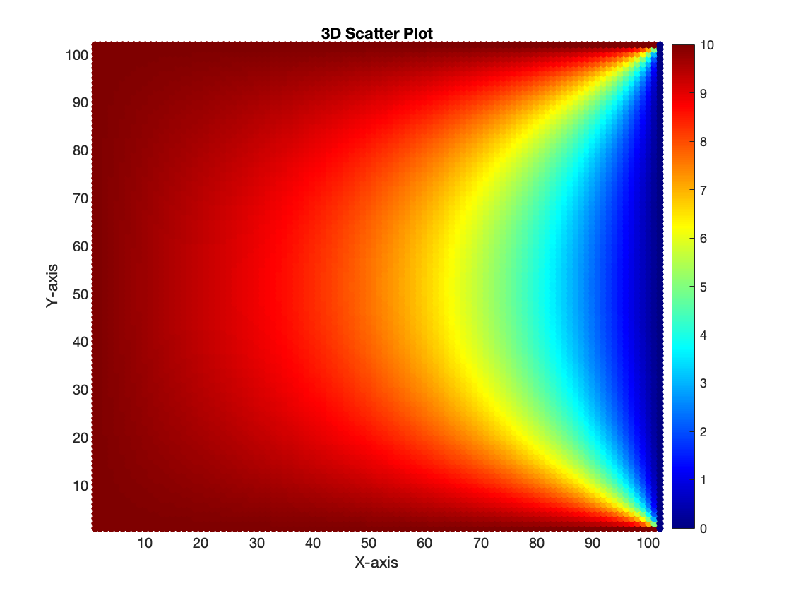
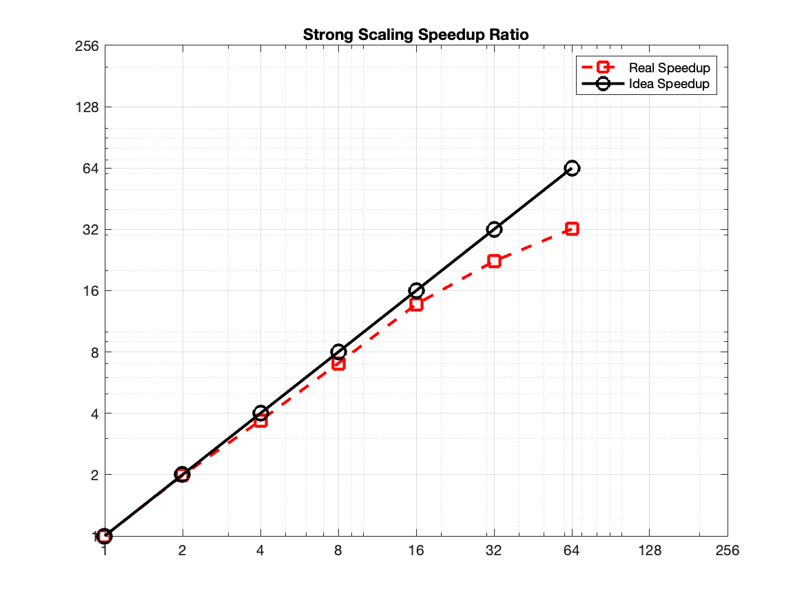

# Final-Project

<!--  -->

This is the final project of M.Sc in High Performance Computing program.


### Development Note
---
#### May, 27-28, 2024
- Working Directory: 
```MPI.Heat/C++Heat/NEW```.
- New Version
    - [ ] Run Strong-Weak Scaling test on multiple nodes.
    - [x] Add basic class for 3d problem.  
    - [x] Add Storing features for 2d and 3d problems which is compatible for ```MATLAB```.

- A demo of Result


---
#### May, 24-26, 2024
- Working Directory: 
```MPI.Heat/C++Heat/NEW```.
- New Version
    - [x] Improve file management.
    - [x] Add Doxygen file and comments.
    - [x] Improve generality of classes design.
    - [x] Prepare 3D problem.
    - [x] Run Strong-Weak Scaling tests on Cluster

- Results of Scaling Tests



---
#### May, 23, 2024
- Working Directory: 
```MPI.Heat/C++Heat```.
- Results of Scaling Tests
Add more tests,


---
#### May, 22, 2024
- Working Directory: 
```MPI.Heat/C++Heat```.

- Results of Scaling Tests


---
#### May, 17, 2024
- Working Directory: 
```MPI.Heat/C++Heat```.

- Add New Features
    - [x] Performance Tests
        - Including in```gperftools\profiler.h``` main file。
        - run script ```gperftools.sh```.
    - [x] ```benchmark.sh```
        - It runs on cluster ```callan``` by SLURM successfully.
    - [ ] OpenMP
        - OpenMP has poor performance when it is inited many times.
    - [ ] Report.pdf
    
---
#### May, 16, 2024
- Working Directory: 
```MPI.Heat/C++Heat```.

- File Management. 
    - Create ```namespace final_project```.
      ```sweep.cpp```, ```environment.cpp```, ```final_project.cpp```, ```initialization.cpp``` and ```array.cpp```.

    - Files ```array.h```, ```array_mpi.h```, ```lib2d.h``` are planning to deprecate.

- Add New Features
    - [x] Add None Blocking Communications
        - See ```void final_project::Array_Distribute<T>::Iexchange()```.
    - [ ] Add ```benchmark.sh```
        Add benchmark shell script of 'weak scaling' and 'strong scaling' tests. The basic grid size is `16x16`.


